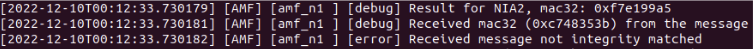

# 12102020

The RF simulator UE does not attach.
The AMF log indicates that the UE's "NAS Security mode response" is rejected by AMF due to "received message not integrity matched".
This problem is likely due to the missing key/opc in OAI UE soft modem command and may be resolved with COTS UE.

